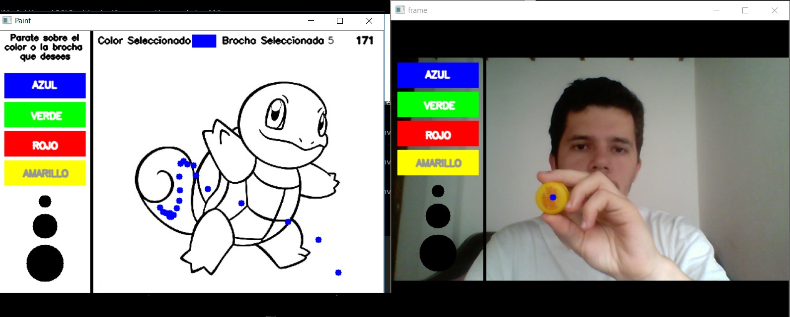

# PAINTURILLO

En este repositorio esta alojado el juego **Painturillo** un proyecto que se creo con la intención de aplicar los conceptos aprendidos en el curso de **Procesamiento Digital de Imagen**.

El juego accederá a la cámara del dispositivo, por medio de esta identificar si el jugador tiene un objeto de color amarillo que cumple las funciones de brocha. En pantalla se mostrará un lienzo que tiene una figura para colorear y además un menú con posibles configuraciones de colores y tamaños de brocha. El objetivo del juego es pintar la figura sin tocar los bordes y sin salirse de la línea antes de que el tiempo llegue a cero.

.

## Project Structure

```
- Imagenes/
    Dibujos/
    Generadas/
- Funciones.py
- ObjectUtils.py
- painturillo.py
```

La estructura anterior contiene la siguiente información

* **Imagenes:** Aquí se guardan todas las imagenes del proyecto, tanto las que se usan para pintar, así como las generadas por el juego.
* **Funciones:** Script que permite extraer los componentes de color de las imagenes.
* **ObjectUtils:** Script con el cual se puede identificar el objeto que se usa como brocha.
* **painturillo:** Script que da vida al juego, con este Script se ejecutan todas las funcionalidades.

## Como usar

Para usar y probar el juego se deben seguir los siguientes pasos.

* 1) **Clonar el repositorio:** En una consola ejecutamos los siguientes comandos.
```
git clone https://github.com/SebasPelaez/pdi-game.git
cd pdi-game
```

* 2) **Crear ambiente de python:** Para crear y activar el ambiente con el cual correra nuestro proyecto debemos seguir los siguientes comandos
```
pip install virtualenv
virtualenv nombre_de_tu_entorno
nombre_de_tu_entorno\Scripts\activate
```

* 3) **Instalar todos los paquetes:** Para que el juego funcione correctamente se deben instalar todas las librerias del archivo _requirements.txt_
```
pip install -r requirements.txt
```

* 4) **Ejecutar el juego:** Luego de correr correctamente los pasos anteriores, debemos ejecutar el siguiente comando para poder jugar.
```
python painturillo.py
```

## Referencias

> Gonzales, R. C., & Woods, R. E. (2002). Digital image processing: Colors Models. (p289)

> Russ, J. C. (2007). The image processing handbook: Processing Binary Images. CRC. Boca Raton, FL.

> Green, B. (2002). Canny edge detection tutorial. Retrieved: March, 6, 2005.

> Gonzales, R. C., & Woods, R. E. (2002). Digital image processing: Morphological Image Preprocessing. (p289)

> Rosebrock, A. (2016). Intersection over Union (IoU) for object detection. Diambil kembali dari PYImageSearch: https://www.pyimagesearch.com/2016/11/07/intersection-over-union-iou-for-object-detection.

> Akshay L Chandra.  (2018).  Tutorial: Webcam paint application Using OpenCV. Recuperado de https://towardsdatascience.com/tutorial-webcam-paint-opencv-dbe356ab5d6c

> Kumar, R. (Julio 20, 2019). Paint-application--Opencv. Github:rajan9519/Paint-application--Opencv: Recuperado de_ https://github.com/rajan9519/Paint-application--Opencv
